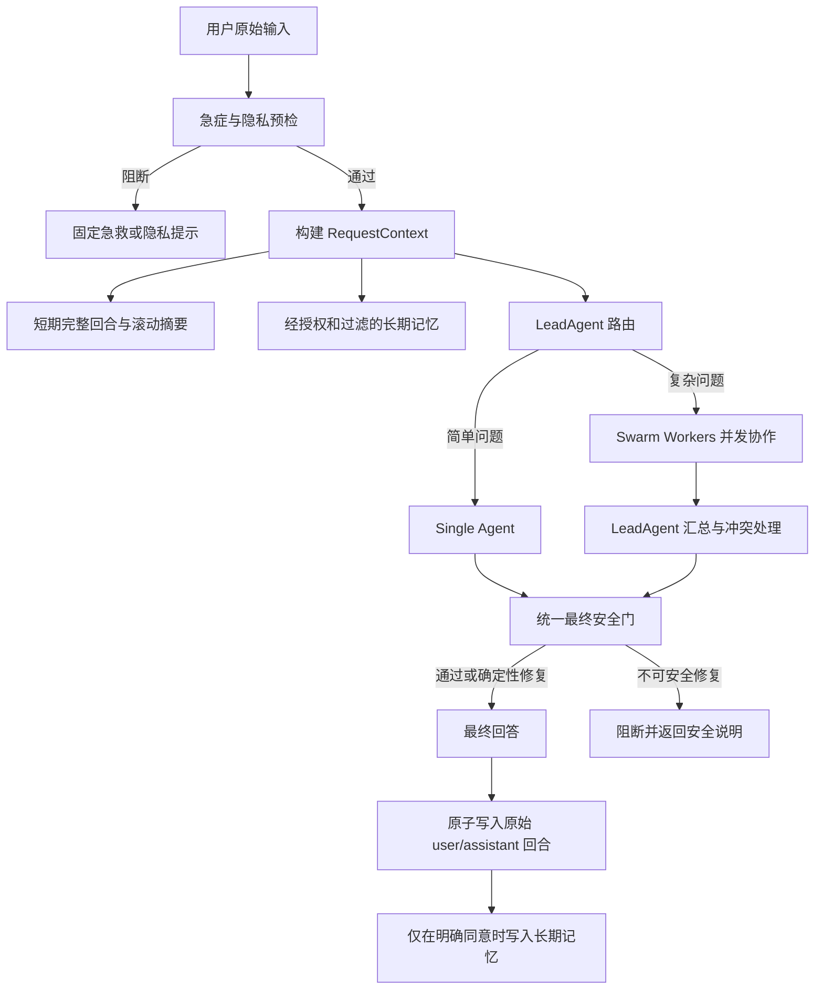

<div align="center">

# MediX Agent Swarm

**面向医疗信息咨询场景的安全型多 Agent 协作原型**

*A safety-oriented multi-agent prototype for medical information assistance.*


[核心能力](#核心能力) · [系统架构](#系统架构) · [快速开始](#快速开始) · [安全与隐私](#安全与隐私) · [项目路线图](#项目路线图)

</div>

## 项目简介

MediX Agent Swarm 探索如何让多个职责不同的 Agent 在同一份、受约束的会话上下文上协作，为用户提供更有结构、可追踪且风险可控的医疗信息。

它不是简单地让多个模型同时回答同一个问题。系统会先完成急症与隐私预检，再根据问题复杂度选择单 Agent 或 Swarm 路径；各 Worker 只获得完成当前任务所需的上下文，最终回答还必须通过统一的安全门才能返回给用户。

这个项目重点关注以下工程问题：

- 多 Agent 协作时，如何避免上下文重复、污染和跨用户泄漏；
- 短期记忆、长期记忆和工具轨迹如何划分边界；
- 如何阻断越权工具调用、确定性诊断和具体处方指令；
- 如何在外部记忆、向量库和网络检索中保护敏感健康信息；
- 如何让安全策略可以测试、审查和持续演进。

## 核心能力

| 能力 | 当前实现 |
|---|---|
| 智能路由 | Lead Agent 根据问题复杂度选择单 Agent 或多 Agent 协作 |
| 专业分工 | 咨询、症状分析、医学研究等 Worker 分别承担受限任务 |
| 统一上下文 | 使用不可变 `RequestContext` 贯穿路由、执行、汇总和持久化 |
| 多轮会话 | 保存原始完整回合，并通过字符预算和滚动摘要控制上下文长度 |
| 记忆隔离 | 按 `tenant_id + user_id + session_id` 隔离短期与长期记忆 |
| 工具调用 | 自动发现 Skills，生成工具 schema，并执行工具白名单校验 |
| RAG 检索 | 支持本地知识文档、Milvus Lite 和可选 Qdrant 后端 |
| 深度研究 | 支持受限域名检索、来源编号、引用覆盖和冲突整理 |
| 安全护栏 | 在输入、工具调用、Worker 输出和最终回答多个阶段执行检查 |
| 隐私控制 | 外部 PHI 读写默认关闭，长期记忆要求配置授权与逐请求同意 |
| 离线测试 | 使用 fake client 验证核心协议，不调用 LLM、Redis、Mem0、Milvus 或网络 |

## Agent 分工

| Agent | 主要职责 | 明确边界 |
|---|---|---|
| `LeadAgent` | 判断 single/Swarm、拆分任务、汇总结果 | 不直接绕过最终安全门 |
| `ConsultationAgent` | 一般健康信息、生活方式建议、初步风险提示 | 不诊断疾病、不提供处方 |
| `DiagnosticAgent` | 症状分析、鉴别方向、风险分层 | 不下确定性诊断、不建议自行治疗 |
| `ResearchAgent` | 文献线索、指南检索、证据综合 | 必须标注来源，不直接给出治疗决策 |

这里的 `DiagnosticAgent` 表示“诊断思路辅助 Agent”，不代表系统具有临床诊断资格。

## 系统架构



一次请求中的主要数据流：

1. 检查急症关键词、否定语境和隐私标识；
2. 组合患者结构化背景、近期完整回合、滚动摘要和检索记忆；
3. 由 Lead Agent 选择 single 或 Swarm；
4. Worker 使用只读的任务视图执行，工具轨迹不写入对话 transcript；
5. Swarm 模式下汇总多 Agent 结果并显式处理冲突；
6. 最终回答统一经过 Safety Gate；
7. 只保存原始用户问题与最终回答，不保存拼装后的 prompt。

## 项目结构

```text
medix-agent-swarm/
├── agents/                 # Worker Agent 及统一 Skill 注册逻辑
├── constraints/            # Agent、工具和 Swarm 的安全策略
├── core/                   # LLM 客户端、Agent Loop、上下文与 PromptBuilder
├── knowledge/              # 本地知识库、来源处理和导入脚本
├── memory/                 # 短期记忆、长期记忆、摘要和 Agent Identity
├── research/               # 网络检索、证据综合与深度研究工作流
├── swarm/                  # 路由、事件、共享上下文和协调器
├── validation/             # 确定性输出修复
├── .claude/skills/         # 当前 Skill 定义与执行脚本
├── examples/test_all.py    # 无外部服务依赖的离线测试
├── main.py                 # 交互式 CLI 入口
├── requirements.txt        # 当前开发依赖
└── setup.py                # 当前打包配置，计划迁移至 pyproject.toml
```

## 快速开始

### 环境要求

- Python 3.10–3.12；
- 一个 OpenAI-compatible Chat Completions 服务；
- 至少配置模型名称和 API key；
- 若启用本地语义检索，需要准备对应的 embedding 模型。

> 当前版本建议直接从源码运行。Python wheel 打包和可选依赖拆分仍在路线图中。

### 1. 克隆项目

```bash
git clone https://github.com/Shaw-Liu7/Med-Multi-Agents.git
cd Med-Multi-Agents
```

### 2. 创建虚拟环境

```bash
python3 -m venv .venv
source .venv/bin/activate
python -m pip install --upgrade pip
pip install -r requirements.txt
```

Windows PowerShell 使用：

```powershell
.venv\Scripts\Activate.ps1
```

当前 `requirements.txt` 包含研究、记忆和 RAG 的完整依赖，因此首次安装可能较大。后续版本将拆分为 `memory`、`rag`、`research` 等可选依赖组。

### 3. 配置 LLM

推荐使用环境变量：

```bash
export MEDIX_LLM_API_KEY="your-api-key"
export MEDIX_LLM_MODEL="your-model-name"
export MEDIX_LLM_BASE_URL="https://your-provider.example/v1"
```

可选参数：

```bash
export MEDIX_LLM_TEMPERATURE="0.2"
export MEDIX_LLM_MAX_TOKENS="4096"
```

配置优先级为：显式传入的字典、环境变量、兼容模式的 `config.py`。兼容配置只通过 `ast.literal_eval` 读取字面量 `LLM_CONFIG`，不会 import 或执行文件中的代码。

除 `localhost`、`127.0.0.1` 和 `::1` 外，`MEDIX_LLM_BASE_URL` 必须使用 HTTPS。

### 4. 配置本地 Embedding（可选）

知识库默认以 `local_files_only=True` 加载 embedding 模型，不会在运行时静默联网下载。如果模型尚未存在于本地缓存，语义检索会失败或进入代码定义的离线降级路径。

只有在你明确允许下载模型时，才设置：

```bash
export MEDIX_ALLOW_MODEL_DOWNLOAD="true"
```

导入本地知识文档时也可以显式授权：

```bash
python -m knowledge.scripts.import_hardcoded_data --allow-model-download
```

模型文件可能较大，请在运行前确认磁盘空间、下载来源和部署环境的数据策略。

### 5. 启动交互式 CLI

```bash
python main.py
```

详细日志模式：

```bash
python main.py --verbose
```

CLI 内置命令：

| 命令 | 作用 |
|---|---|
| `help` | 查看帮助 |
| `clear` | 清除当前短期会话并创建新 session |
| `exit` / `quit` | 退出程序 |

## Python API 示例

```python
import asyncio

from swarm import SwarmCoordinator


async def main() -> None:
    coordinator = SwarmCoordinator()
    try:
        result = await coordinator.process(
            "最近睡眠不规律，如何调整生活习惯？",
            context={
                "patient_profile": {"age": 35},
                "memory_consent": False,
            },
            tenant_id="demo-tenant",
            user_id="demo-user",
            session_id="demo-session",
            turn_id="turn-1",
        )
        print(result["answer"])
    finally:
        await coordinator.aclose()


asyncio.run(main())
```

部署方必须从可信身份系统提供 `tenant_id` 和 `user_id`，不能允许模型或普通用户文本指定其他人的身份与 session。

## 记忆设计

### 短期记忆

短期记忆保存同一会话内的完整 `user/assistant` 回合，并提供：

- tenant、user、session 三级作用域隔离；
- 完整回合裁剪，避免出现孤立 assistant 消息；
- 字符预算和滚动摘要；
- 内存模式并发锁；
- Redis list、transaction 和 TTL；
- transcript 与工具 trace 分离。

```python
from memory import ShortTermMemory

memory = ShortTermMemory(storage_type="memory")
memory.add_turn(
    "session-1",
    "原始用户问题",
    "最终面向用户的回答",
    tenant_id="tenant-1",
    user_id="user-1",
)

history = memory.get_history(
    "session-1",
    tenant_id="tenant-1",
    user_id="user-1",
    limit=5,
)
```

### 长期记忆

Mem0 是可选适配器。没有注入 client 或配置 `MEM0_API_KEY` 时，长期记忆保持关闭，短期会话仍可运行。

外部 PHI 读写必须同时满足：

1. 部署方设置 `allow_external_phi=True`；
2. 当前请求包含 `memory_consent=True`；
3. 具体读写调用显式传入 `consent=True`。

长期记忆还会检查租户与用户作用域、相似度、过期时间、来源、当前 session 和内容去重。`delete_memory()` 只提供底层删除能力；完整的数据访问、导出、撤回授权和审计流程仍需由部署方实现。

### 本地 Session Summary

`SessionSummaryManager` 只有在 `consent=True` 时才允许落盘，并以唯一名称原子写入 JSON 和可逆 Markdown。路径组件会经过清洗与哈希，防止目录穿越和直接暴露用户标识。

## 安全与隐私

MediX 使用分层安全检查，而不是只依赖 system prompt：

```text
输入预检 → 工具 schema 过滤 → 工具调用校验 → Worker 输出检查
        → Swarm 汇总约束 → 最终统一安全门 → 受控持久化
```

当前安全策略包括：

- 急症输入在 LLM 和工具调用前短路；
- 未知 Agent 和越权工具默认拒绝；
- single 与 Swarm 使用相同的最终安全门；
- 检测并弱化确定性诊断、具体处方、绝对承诺和延误急救等表达；
- 检测常见手机号、身份证号和电子邮箱，并避免在日志中回显；
- 不记录 API key、完整请求正文或可能包含 PHI 的异常内容；
- 检索记忆和其他 Agent 结果都按“不可信数据”注入 prompt；
- 无法安全修复的问题直接阻断，不生成虚假引用。

这些规则只是工程护栏。关键词、正则和 LLM 判断都可能误报或漏报，不能证明回答医学正确。

生产环境还必须补充：

- 认证、授权和最小权限控制；
- 传输与静态数据加密；
- 数据保留、访问、导出和删除机制；
- 操作审计、异常告警和人工升级流程；
- 外部供应商的数据处理协议；
- 临床安全评估、红队测试与持续监控。

## 知识库与来源说明

`knowledge/data/documents/` 中的内置文本目前仅用于开发演示。导入时统一标记为：

```text
verification_status = unverified
intended_use = development_demo
```

它们没有完整的出版标识、许可证明或临床审核记录，不能代表当前有效的权威指南，也不能作为处方、诊断或急救依据。

未经核验的知识片段在送入模型前会经过保守过滤，具体治疗指令、剂量和诊断阈值可能被隐藏；但这种正则过滤不是事实核验的替代品。公开发布和真实部署前，应为每份资料补齐来源、版本、DOI/URL、许可、适用人群、审核人与最后核验时间，或替换为具有明确开放许可的数据集。

运行生成的 Milvus Lite 数据库、会话摘要和用户数据已加入 `.gitignore`，不应提交到版本库。

## 网络研究边界

研究 Agent 可以搜索受限域名并为来源分配 `[S1]`、`[K1]` 等编号。检索内容会被视为不可信材料，报告只保留引用了已提供来源编号的关键发现。

当前实现仍有以下限制：

- 搜索结果摘要不等于论文或指南全文；
- 域名白名单不等于内容已经过医学审核；
- 网页可能更新、过期或缺少适用人群信息；
- 证据等级只能在结构化来源信息支持时提高；
- 外部内容的版权、时效性和引用完整性仍需独立确认。

## 离线验证

运行全部离线测试：

```bash
python3 examples/test_all.py
```

测试使用标准库和 fake client，不访问 LLM、Mem0、Redis、Milvus 或互联网。当前覆盖：

- LLM 配置优先级、HTTPS 限制和工具调用协议；
- 急症输入、隐私检测、安全最终门和工具阻断；
- single → Swarm → single 的上下文连续性；
- PromptBuilder 不重复注入历史内容；
- 多租户记忆隔离、完整回合和并发追加；
- 长期记忆授权、去重、分数与过期过滤；
- Session Summary 无损回读、非覆盖写入和路径安全；
- 包数据、入口、凭据形态和机器绝对路径的静态约束。

测试成功不代表系统已通过临床验证。真实 LLM、Redis、Mem0、Milvus、网络研究和 wheel 安装仍需要独立的集成测试。

## 已知限制

- 当前只提供交互式 CLI，没有正式 Web API 或前端；
- Python 打包仍在从 `setup.py` 向 `pyproject.toml` 迁移；
- 依赖尚未拆分为基础和可选功能组，完整安装体积较大；
- Skills 仍存放在 `.claude/skills`，安装后资源发现机制需要完善；
- 内置医学文本尚未完成来源、版权和临床内容审核；
- 没有完成真实供应商和外部存储的端到端验证；
- 没有完成临床安全性、偏差、敏感度/特异度或对抗提示评测；
- sequential 和 debate 协作模式尚未实现；
- Safety Gate 只能降低部分已知风险，不能保证回答正确或安全。

## 项目路线图

- [x] 统一不可变请求上下文
- [x] single/Swarm 共享最终安全门
- [x] 多租户短期与长期记忆隔离
- [x] 外部 PHI 明确授权边界
- [x] 工具白名单与 fail-closed 校验
- [x] 无网络、无真实模型的离线测试
- [ ] 迁移到 `pyproject.toml` 和 `src/` 包布局
- [ ] 修复 wheel 资源打包并增加安装后 smoke test
- [ ] 拆分 `memory`、`rag`、`research` 可选依赖
- [ ] 增加 Python 3.10–3.12 GitHub Actions 测试矩阵
- [ ] 增加 Ruff、类型检查、覆盖率、依赖审计和 secret scanning
- [ ] 为内置语料建立 Data Card、开放许可和医学审核记录
- [ ] 完成 Redis、Mem0、Milvus 和网络检索集成测试
- [ ] 建立临床安全评测集、红队测试和人工升级流程
- [ ] 提供可复现的 Demo、性能指标和 single/Swarm 对比

## 参与贡献

欢迎通过 Issue 提交 bug、设计建议、安全问题和可复现的测试案例。涉及医学内容的贡献请同时提供可核验来源、版本、适用人群和使用许可，不能仅提交未经验证的模型生成文本。

正式接受代码贡献前，项目还将补充：

- `CONTRIBUTING.md`
- `CODE_OF_CONDUCT.md`
- `SECURITY.md`
- Issue 与 Pull Request 模板
- 开发环境、测试和提交规范

若发现可能导致隐私泄漏、越权数据访问、危险医疗建议或安全门绕过的问题，请不要在公开 Issue 中附带真实患者信息、API key 或可识别个人身份的数据。

## 许可证

项目目前尚未提供正式 `LICENSE` 文件。在许可证确定之前，请不要假定本项目可被复制、修改、再分发或用于商业场景。

代码许可证与医学资料许可证应分别确认；即使代码采用开源许可证，也不代表内置指南、文档或第三方内容自动获得相同授权。

---

<div align="center">

**Build carefully. Validate continuously. Keep humans in the loop.**

</div>
